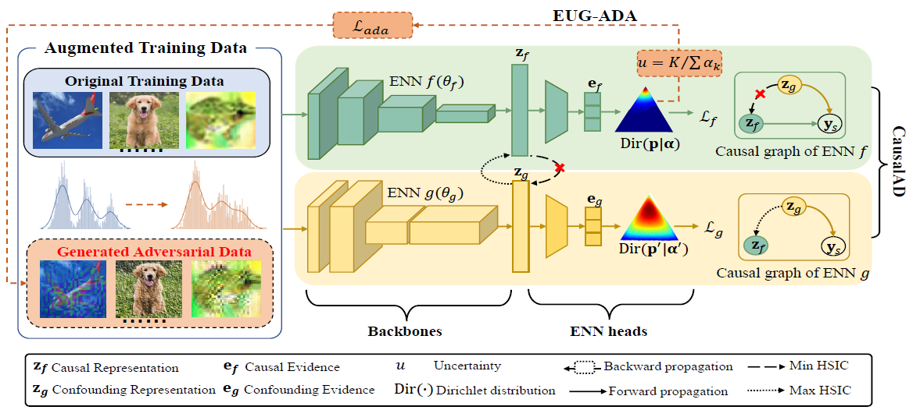

## Causal Evidence Learning for Trusted Open Set Recognition under Covariate Shift

## Installation
```
conda create --name cel python==3.8
conda activate cel
conda install pip
git clone https://github.com/ScorpioBao/CEL-OSR.git
cd CEl-OSR
pip install -r requirements.txt
```
## Datasets
#### The datasets (Digits, CIFARs, CMNIST): https://figshare.com/articles/figure/data_zip/22140566
#### Tiny-ImageNet: https://www.kaggle.com/c/tiny-imagenet/data
#### PACS：https://domaingeneralization.github.io/#data
#### DomainNet: https://ai.bu.edu/M3SDA/
#### Download the “data“ folder and add it to the root directory of this project.